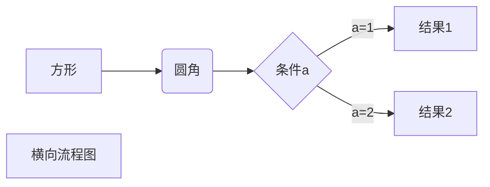

# 开发资源整理

编写目的

此文档使用[markdown](/lib/markdown)

> 这是一段引用
```md
> 这是一段引用
```




## 这是一段代码
```js
const value = "test value";
console.log(value);
```


# # 标题一
## ## 标题二
### ### 标题三
#### #### 标题四
##### ##### 标题五
###### ###### 标题六
